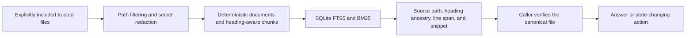

# Architecture

Boring Agent Memory has three layers:

1. Trusted canonical files.
2. A rebuildable local SQLite index over deterministic Markdown chunks.
3. Small query interfaces that return source-grounded citations.

The index is not the source of truth.
It is a recall cache over files the user already trusts.

## Schema Lifecycle

`PRAGMA user_version` is the authoritative index schema version.
Schema version 2 stores `documents`, `chunks`, `chunks_fts`, and one `index_metadata` row.
Legacy unversioned indexes migrate inside one SQLite transaction and remain queryable after migration.
Because legacy indexes did not store raw-byte hashes, migrated rows expose canonical verification as unavailable until a full rebuild instead of treating a redacted hash as raw evidence.
An unknown future schema is rejected instead of being rewritten.

Each newly built document stores a path-derived deterministic ID, a raw-byte source hash, a redacted-content hash, source metadata, and the redacted full text.
Migrated documents recompute redacted-content hashes from their stored text and leave the unavailable raw hash empty.
Each chunk stores a deterministic ID, heading ancestry, a duplicate-heading key, a structural ordinal, a source line span, and redacted text.
The FTS table indexes chunk title, heading, content, and source path.

## Markdown Chunking

Markdown is split by heading ancestry and structural blocks.
Fenced code, lists, block quotes, and tables stay intact even when one protected block exceeds the preferred chunk size.
Ordinary paragraphs can be split to stay within the configured bound.
Chunk IDs are content-addressed over the document identity, exact NFC-normalized structural heading ancestry, exact redacted chunk text, duplicate-content multiplicity, and an occurrence index.
An ID can survive unrelated insertions, deletions, and line shifts only while it still names the same semantic content.
Splits, merges, heading changes, and body changes produce new IDs instead of silently rebinding old IDs.
Duplicate content receives unique IDs and is handled fail-closed.
Any document chunk-structure change invalidates each identical-content identity group because a stateless chunker cannot safely distinguish old physical occurrences after insertions, deletions, or replacements.
Duplicate and non-ASCII headings retain separate structural keys for ordering and storage constraints.

Non-Markdown text uses paragraph-aware bounded chunks.
A chunk size of `0` creates one whole-document chunk and is used only for controlled comparisons.

## Transactional Builds and Updates

Filesystem reads, redaction, hashing, and chunking finish before the database write transaction begins.
`bam build` replaces every document, chunk, FTS row, and metadata row in one transaction.
`bam update` compares raw source hashes, detects unique moves, and applies additions, edits, moves, and removals in one transaction.
Ambiguous duplicate-content renames are reported as additions and removals.
Before commit, foreign keys and chunk-to-FTS row counts are checked.
Any failure or process interruption before commit leaves the previous index queryable.

The configuration fingerprint covers source scope, workspace, source type, file-size limit, chunk settings, schema and ID versions, tokenizer, and privacy policy.
Incremental update refuses to run when the effective configuration differs from the last build.
`bam update --dry-run` opens a checkpointed SQLite database in immutable read-only mode and reports the exact planned paths without migration, sidecar creation, or mutation.

## Query Flow

The query engine tries:

1. Strict phrase retrieval.
2. Token AND retrieval.
3. Token OR retrieval.
4. A LIKE fallback for awkward punctuation or FTS syntax failures.

BM25 results are deduplicated by document while retaining the best matching chunk.
Every result includes a chunk ID, heading ancestry, line span, stable citation, source path, score, and snippet.
Agents should read the cited source before making state-changing claims.

## Optional Dense and Hybrid Retrieval

The default installation does not contain an embedding runtime and never downloads a model.
The `embeddings` extra provides a FastEmbed adapter that requires a concrete local model path unless download permission is explicitly enabled.
Titles, headings, chunk text, and queries are redacted again at the embedding boundary before they are sent to the adapter.
Source paths and citations are not embedding inputs, and text never leaves the machine through this implementation.
Hybrid ranking uses weighted reciprocal rank fusion rather than mixing incomparable BM25 and cosine scores.
Lexical and dense candidate pools use the same recorded depth before fusion.

The optional adapter is currently an evaluation surface, not a replacement for canonical-first BM25.

## Non-Goals

- No automatic raw conversation capture.
- No vector database requirement.
- No graph memory requirement.
- No hosted service requirement.
- No broad tool surface.
