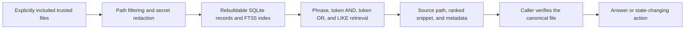

# Architecture

Boring Agent Memory has three layers:

1. Trusted canonical files
2. A rebuildable local SQLite FTS5 index
3. A tiny query interface for agents

The index is not the source of truth. It is a recall cache over files the user already trusts.

The benchmark reuses the same ingest and query path, then compares it with exact phrase grep over the redacted corpus.
The benchmark report is evidence about retrieval behavior, not another runtime layer.

## Data Model

Each indexed record stores:

- `id`
- `source_type`
- `source_path`
- `workspace`
- `title`
- `content`
- `content_hash`
- `metadata_json`
- `updated_at`

The FTS table stores `title`, `content`, and `source_path` for BM25 retrieval.

## Query Flow

The query engine tries:

1. strict phrase query
2. token AND query
3. token OR query
4. LIKE fallback for awkward punctuation or FTS syntax failures

Every result includes a source path and snippet. Agents should read the source before making state-changing claims.

## Non-Goals

- no automatic raw conversation capture
- no vector database requirement
- no graph memory requirement
- no hosted service requirement
- no broad tool surface
